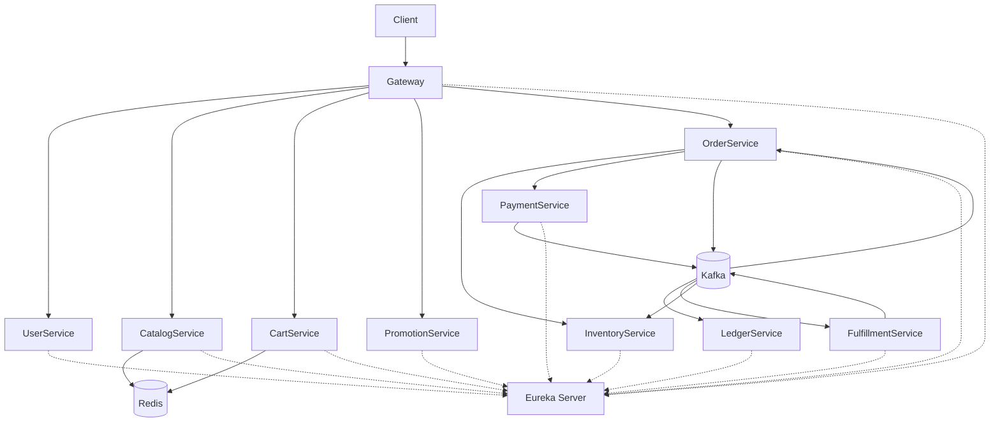

# Retail Omnichannel Order Platform

## Overview

Retail Omnichannel Order Platform is a microservices-based commerce platform designed to support end-to-end retail order processing.

The platform demonstrates modern backend architecture patterns including:

- Microservices Architecture
- Event-Driven Communication
- Distributed Transaction Management (Saga)
- Inventory Reservation Pattern
- Payment Idempotency
- Ledger Audit Trail
- Database Sharding
- Distributed Caching
- API Gateway Authentication

The system supports the complete order lifecycle from product browsing and cart checkout to payment authorization, fulfillment tracking, and order completion.

---

## Design Patterns

### Saga Pattern

Used to maintain eventual consistency across distributed services.

### Reservation Pattern

Used by Inventory Service to prevent overselling.

### Idempotency Pattern

Used by Payment Service to prevent duplicate payment processing.

### Event-Driven Architecture

Kafka-based asynchronous communication between services.

### Database Sharding

Order data is horizontally partitioned using ShardingSphere.

## System Architecture

## Technology Stack

### Backend

- Java 17
- Spring Boot 3
- Spring Cloud
- Spring Security
- JWT Authentication
- Spring Data JPA
- OpenFeign

### Messaging

- Apache Kafka
- Dead Letter Queue (DLQ)

### Data

- MySQL
- Redis
- Apache ShardingSphere

### Infrastructure

- Eureka Service Discovery
- API Gateway
- Saga Pattern
- Event-Driven Architecture

---

## Core Business Flow

User Login
↓
Browse Catalog
↓
Add Items to Cart
↓
Create Order
↓
Reserve Inventory
↓
Authorize Payment
↓
Publish Payment Event
↓
Create Ledger Entry
↓
Commit Inventory
↓
Create Fulfillment
↓
Update Fulfillment Status
↓
Complete Order

---

## Event Driven Architecture

### ORDER_CREATED

Order Service
↓
Kafka
↓
Fulfillment Service
↓
Create Fulfillment Record

### PAYMENT_AUTHORIZED

Payment Service
↓
Kafka
↓
Ledger Service
↓
Create Ledger Entry

Payment Service
↓
Kafka
↓
Inventory Service
↓
Commit Reserved Inventory

### FULFILLMENT_SHIPPED

Fulfillment Service
↓
Kafka
↓
Order Service
↓
Update Order Status

---

## Saga Compensation

### Successful Flow

Order Created
↓
Inventory Reserved
↓
Payment Authorized
↓
Inventory Committed
↓
Fulfillment Created

### Compensation Flow

Order Created
↓
Inventory Reserved
↓
Payment Failed
↓
Inventory Released
↓
Order Cancelled

---

## Database Strategy

### Order Sharding

Orders are horizontally partitioned using Apache ShardingSphere.

Databases:

- order_db_0
- order_db_1

Sharding Key:

- order_id

### Service Databases

- user_db
- catalog_db
- inventory_db
- payment_db
- ledger_db
- fulfillment_db
- promotion_db

---

## Key Features

- Microservices Architecture
- API Gateway + JWT Authentication
- Service Discovery with Eureka
- Redis Distributed Caching
- Kafka Event-Driven Communication
- Saga Distributed Transaction Pattern
- Inventory Reservation Pattern
- Payment Idempotency
- Ledger Audit Trail
- Database Sharding
- Dead Letter Queue Handling

## Microservices Overview

### API Gateway

Responsibilities:

- Single entry point for all client requests
- JWT authentication
- Request routing
- Header propagation
- Cross-service access control

---

### User Service

Responsibilities:

- User registration
- User authentication
- JWT token generation
- Role management

Database:

- user_db

---

### Catalog Service

Responsibilities:

- Product catalog management
- Product search
- Product information retrieval
- Redis caching

Database:

- catalog_db

---

### Cart Service

Responsibilities:

- Shopping cart management
- Cart item validation
- Redis-based cart storage
- Cart expiration management

Storage:

- Redis

---

### Promotion Service

Responsibilities:

- Promotion validation
- Discount calculation
- Campaign management

Database:

- promotion_db

---

### Order Service

Responsibilities:

- Order creation
- Order management
- Order status tracking
- Saga orchestration
- Event publishing

Database:

- order_db_0
- order_db_1

Key Features:

- ShardingSphere
- Kafka Producer
- Saga Coordinator

---

### Inventory Service

Responsibilities:

- Inventory reservation
- Inventory commitment
- Inventory release
- Stock consistency

Database:

- inventory_db

Key Features:

- Reservation Pattern
- Optimistic Locking

---

### Payment Service

Responsibilities:

- Payment authorization
- Payment failure handling
- Payment idempotency
- Payment event publishing

Database:

- payment_db

Key Features:

- Idempotency Key
- Kafka Event Producer

---

### Ledger Service

Responsibilities:

- Financial audit records
- Immutable transaction history
- Accounting traceability

Database:

- ledger_db

Key Features:

- Audit Trail
- Event Consumer

---

### Fulfillment Service

Responsibilities:

- Shipment creation
- Fulfillment tracking
- Shipment status updates
- Fulfillment event publishing

Database:

- fulfillment_db

Key Features:

- Event Consumer
- Event Producer